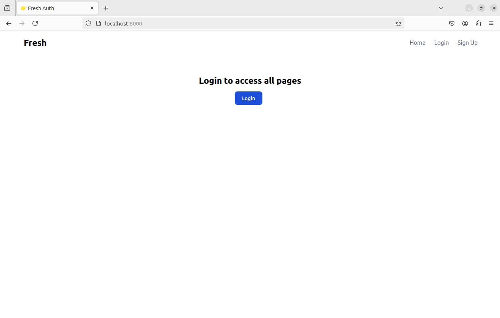
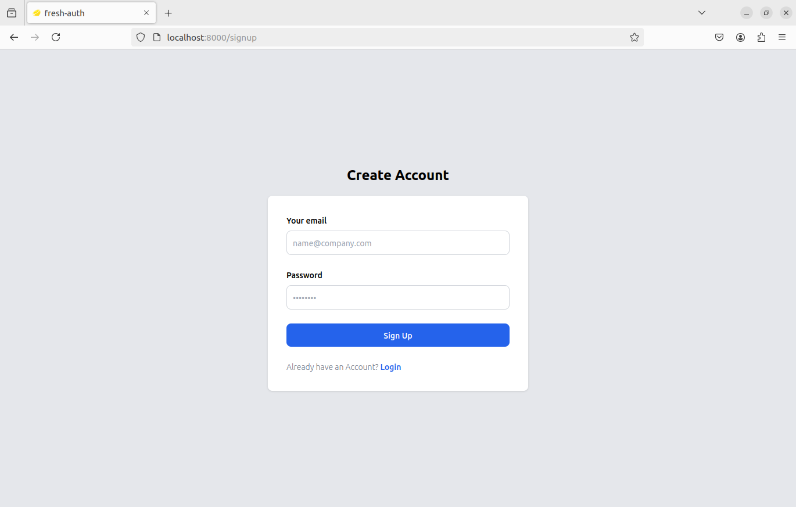
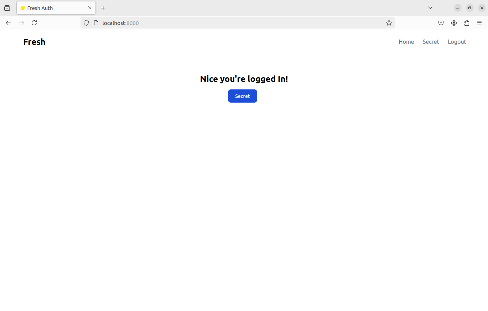

# Fresh Fedify App

## Table of Contents


## Overview

This project is a web application built using [Fresh](https://fresh.deno.dev/), a modern web framework for Deno, designed to be fast and efficient. The application implements the Fedify Framework

## Features


## Getting Started

### Prerequisites

- **Deno:** Ensure you have Deno installed. You can download it from [deno.land](https://deno.land/).

### Installation

1. **Clone the repository:**

   ```bash
   
   ```

2. Set up environment variables:

Create a .env file in the root directory and add your Supabase credentials:

    ```bash
    
    ```

1. Install dependencies:

Fresh doesn't require a package manager like npm or yarn. However, make sure you have Deno installed.

4. Run the development server:

Start the Deno development server with:

    ```bash
    deno task start
    ```

The app will be available at [http://localhost:8000](http://localhost:8000).

## 📂 Project Structure

```bash
```

## Usage


## Middleware

The `_middleware.ts` file handles the authentication logic. It checks if the user is logged in by verifying the presence of a Supabase token in the cookies. If the token is valid, the user can access protected routes.

## Deployment

To deploy the application, you can use Deno Deploy or any other platform that supports Deno. Ensure your environment variables are set up correctly in the deployment environment.

## Contributing

Contributions are welcome! Please fork the repository and use a feature branch. Pull requests are warmly welcome.

## 📸 Screenshots
### Home Page


### Sign Up


### Login




### Access Restricted Page


## License

This project is open source and available under the MIT License.

## 🙌 Acknowledgments

    Fresh Framework
    Preact
    Deno
    Tailwind CSS
    Fedify Framework

Thanks to [@learnbydoing993](https://github.com/learnbydoing993) for this [code](https://github.com/learnbydoing993/fresh-auth-supabase).   

## 📬 Contact

Feel free to reach out if you have any questions or suggestions!

[LinkedIn](www.linkedin/in/mdumbu) 

[Mastodon](https://mastodon.social/@backyardcoding)
